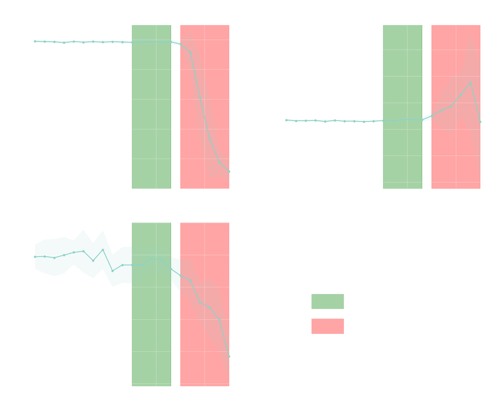

# Temperature vs singularity

Where does an LLM's writing become *singular* — distinctive, stylised — without breaking? This repo sweeps the sampling temperature of a single model on three French creative-writing prompts and tracks three quantitative signals to locate the zone where output is most diverse while still coherent, and the threshold past which it falls apart.



## Method

For each temperature in a sweep, the model is given three short French prompts (`dialog`, `storyboard`, `synopsis`, 30 iterations each) and the completion is scored on:

- **Linguistic integrity** — fastText `lid.176` confidence that the output is French. Drops sharply once the model starts producing token soup.
- **Lexical diversity** — MTLD ([McCarthy & Jarvis, 2010](https://link.springer.com/article/10.3758/BRM.42.2.381)) on the cleaned text.
- **Semantic similarity to the prompt** — cosine similarity between sentence-BERT embeddings (`paraphrase-multilingual-MiniLM-L12-v2`) of prompt and completion.

Each metric is aggregated per temperature with a robust central tendency (median) and an IQR error band. The plot then highlights two zones:

- **Singularity zone** (green) — diversity is climbing while integrity and similarity still hold.
- **Breakdown regime** (red) — integrity collapses; the model is no longer producing coherent French.

For gpt-4.1 on these prompts, the singularity zone sits around **T ∈ [1.0, 1.4]** and the breakdown regime starts around **T ≈ 1.5**.

## Repository layout

```
text_analysis.py     # metrics + plotting primitives
metrics.py           # CLI: runs the full sweep set and renders figures
results/             # raw model completions per sweep (JSON)
figures/             # rendered figures (PNG)
```

## Setup

The project uses [uv](https://docs.astral.sh/uv/).

```bash
curl -LsSf https://astral.sh/uv/install.sh | sh   # if needed
uv sync
```

The fastText language-ID model (`lid.176.bin`, ~125 MB) is downloaded automatically on first run.

## Usage

Run the full sweep set and show figures inline:

```bash
uv run python metrics.py
```

English labels, dark theme, save figures to `figures/`, export the full-sweep stats to CSV:

```bash
uv run python metrics.py --language en --dark --save-figures --export-csv
```

## Data

`results/*.json` contains the raw completions used in the figures. Each record:

```json
{
  "prompt_label": "dialog",
  "user_prompt": "...",
  "temperature": 1.2,
  "iteration": 7,
  "text": "..."
}
```

The completions themselves were generated separately (not in this repo); this repo is the analysis pipeline over them.
